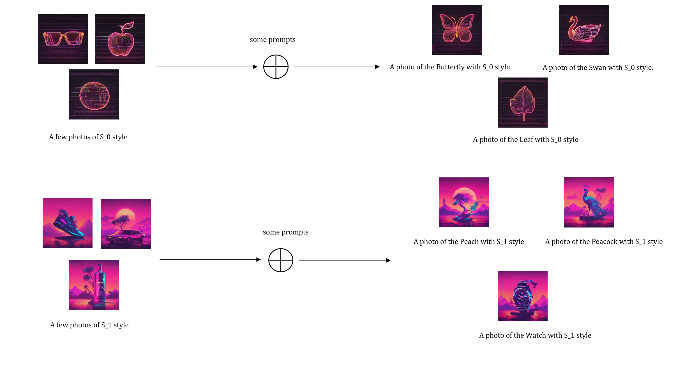

# Jittor B 榜风格迁移图片生成赛题 基于 Dreambooth-lora 的风格图片微调算法 - [  摇钱树 ] 战队

<!-- | 标题名称包含赛题、方法 -->

> 

<!-- > /TODO 放几张生成的效果好的图片，和数据集的参考图片，并给出简要描述，介绍咱们的算法的效果。 -->

> 如图所示，只需提供少量示例图片即可识别该组图片的风格，并通过提示词如 "A photo of XXX with S_0 style" 来生成具有该风格的对应物体图像。算法有效地捕捉了风格特征，从而实现精确的图像生成。

<!-- ｜展示方法的流程特点或者主要结果等 -->

## 简介

<!-- | 简单介绍项目背景、项目特点 -->

本项目包含了第四届计图挑战赛计图 - 风格迁移图片生成赛题的代码实现。近年来随着扩散模型的发展，涌现了一大批图片生成或者编辑的算法，其中一个重要的课题就是可控生成。在可控图片生成中一个相当有艺术性的研究课题是风格迁移问题：旨在将一种图像的风格应用到另一张图像上，同时保留后者的内容结构。

本项目的特点是：

- 使用 Dreambooth-lora 的方法框架，基于若干张风格参考图像微调 Stable Diffusionv2.1 模型。
- 同时微调了 Stable Diffusionv2.1 模型的 Unet 网络和 Text encoder 网络的 Atetnion 层参数。
- 使用提示词推理模型，如 chatgpt4o 推理图像的提示词，并基于提示词推理使用初始化 text embbding。
- 使用 prior preservation loss 提升微调过程总模型对图片内容信息的保留。

## 安装

<!-- | 介绍基本的硬件需求、运行环境、依赖安装方法 -->

本项目可在 1 张 4090 上运行，训练时间约为 1 小时。

#### 运行环境

- ubuntu 20.04.2 LTS
- python >= 3.9
- jittor >= 1.3.9

#### 安装依赖

首先按照 [JDiffusion](https://github.com/JittorRepos/JDiffusion/blob/master/README.md) 的安装指导安装必要的依赖，除此之外还需要安装 peft 库依赖。

```
pip install accelerate==0.27.2
pip install peft==0.10.0
```

或者执行以下命令安装必要的依赖

```
conda env create -f environment.yml
```

#### 预训练模型

预训练模型模型下载地址为 `https://huggingface.co/stabilityai/stable-diffusion-2-1`

<!-- ## 数据预处理 -->

## 数据预处理

为了提升模型的表现，本项目对输入图像进行了系统化的数据预处理和数据增强操作。

### 数据预处理步骤

1. **图像大小调整**  
   将所有输入图像统一调整为指定的尺寸（512×512），使其符合模型输入的要求。

2. **随机翻转**  
   以 0.1 的概率对图像进行随机的水平或垂直翻转,以增加数据集的多样性，增强模型对不同图像方向的鲁棒性。

3. **随机旋转**  
   对图像进行 0.1 弧度的随机旋转，使得模型学习到更加丰富的旋转不变性，进一步增加数据的多样性。

4. **随机仿射变换**  
   应用随机仿射变换，使得模型更好地适应数据中的几何变换。

5. **图像归一化**  
   使用均值为 0.5、标准差为 0.5 的归一化操作，提高模型训练的稳定性，加速收敛，并提升整体性能。

## 训练

<!-- ｜ 介绍模型训练的方法 -->

单卡训练可运行以下命令：

```
./train.sh
```

## 推理

<!--
｜ 介绍模型推理、测试、或者评估的方法 -->

生成测试集上的结果可以运行以下命令：

```
python test.py
```
## 数据集、采样参数json、lora权重下载地址

`https://pan.baidu.com/s/1QDfQ1L60j5-r0YENssPKbQ?pwd=6666`


<!-- ## 致谢

| 对参考的论文、开源库予以致谢，可选

此项目基于论文 _A Style-Based Generator Architecture for Generative Adversarial Networks_ 实现，部分代码参考了 [jittor-gan](https://github.com/Jittor/gan-jittor)。 -->

<!-- ## 注意事项

点击项目的“设置”，在 Description 一栏中添加项目描述，需要包含“jittor”字样。同时在 Topics 中需要添加 jittor。

 -->

## 联系方式

李祥 QQ：1739781578

余桉然 QQ：2648521315

冯威 QQ：2824285778
